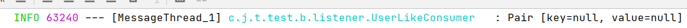
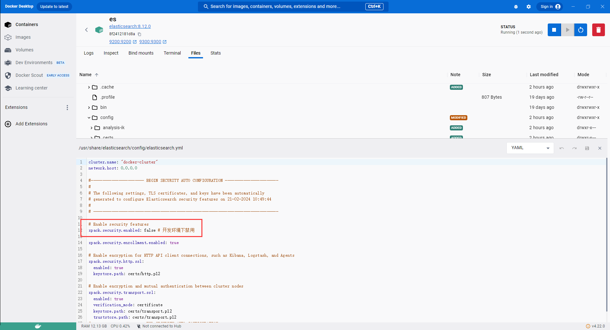
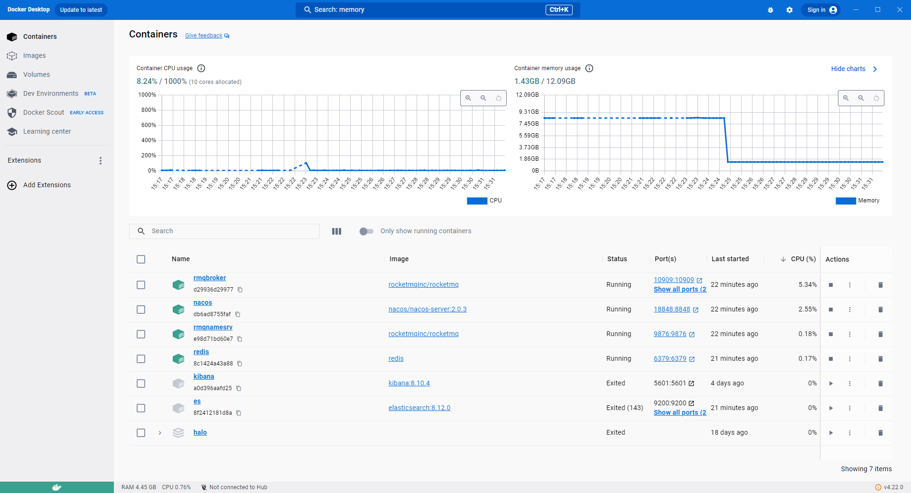
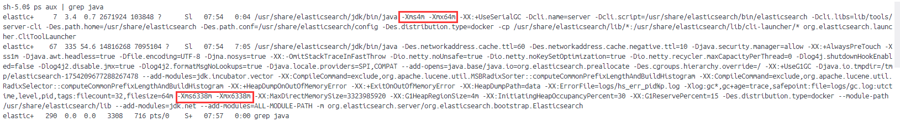
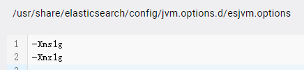
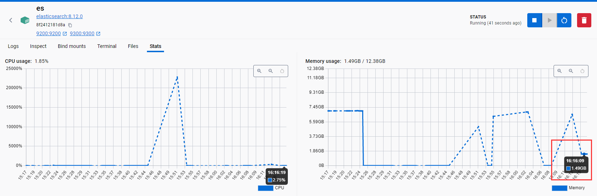

# JPA

## 1. JPA同时使用OneToMany和ManyToOne注解导致的ToString和序列化无限递归

重写其中一个toString方法打破无限递归，使用的是Lombok的话使用@ToString.Exclude注解放在递归属性上

序列化处理同理，使用jackson的@JsonIgnore来排除递归属性

# RocketMQ

## 1. 消息值丢失

consumer接收到的对象不为null，但是内部属性全为null

深入debug后发现是负责序列化的MappingFastJsonMessageConverter这个类在将Message内部的Payload对象转换为字节流的时候出现了问题。字节流最后出来的时候只剩左右括号，而其中的数据不知去向。

解决方案：

修改RocketMqAdapter中的配置，将RocketMQMessageConverter改为MappingJackson2MessageConverter，问题解决！

## 2. 消费成功后又接收到多次空值对象

# Elasticsearch

## 1.无法找到可用证书

Caused by: javax.net.ssl.SSLHandshakeException: sun.security.validator.ValidatorException: PKIX path building failed: sun.security.provider.certpath.SunCertPathBuilderException: unable to find valid certification path to requested target

elasticsearch8默认开启了ssl验证，http协议下无法访问，https协议下又因为es没有证书（certification）所以抛出如上错误。解决方法有二

1.配置证书

[配置 SSL、TLS 以及 HTTPS 来确保 Elasticsearch、Kibana、Beats 和 Logstash 的安全 | Elastic Blog](https://www.elastic.co/cn/blog/configuring-ssl-tls-and-https-to-secure-elasticsearch-kibana-beats-and-logstash#create-ssl)

2.关闭ssl验证

方法一比较麻烦且现在是开发环境所以就先使用关闭ssl的方法，然后修改访问的url为http就行了

## 2. Es跑满内存导致电脑卡顿

下图是关闭了es前后的Docker页面，右边MemoryUsage图示中可以看出es占据了7个G的内存，致使我的开发电脑卡顿

使用 ps aux | grep java 命令查询es容器中的程序运行情况，得到结果如下图。好家伙，一共两java程序，第二个es本体的堆内存分配给到了6338m。这自动内存配置有点狠（所以以后安装的时候还是自己配置比较好）

解决方案

1. 重新在docker中安装es，安装命令中配置jvm的Xmx和Xms
2. 根据es官方的建议修改jvm配置文件
   1. [Setting JVM options | Elasticsearch Guide [8.12] | Elastic](https://www.elastic.co/guide/en/elasticsearch/reference/8.12/jvm-options.html)

这里使用第二种方法在es安装目录`/usr/share/elasticsearch/config/jvm.options.d/`下创建一个以.options为后缀的文件，文件内容如下图，分配栈内存1g。

重启容器后内存使用来到了一个开发环境可接受的区域

